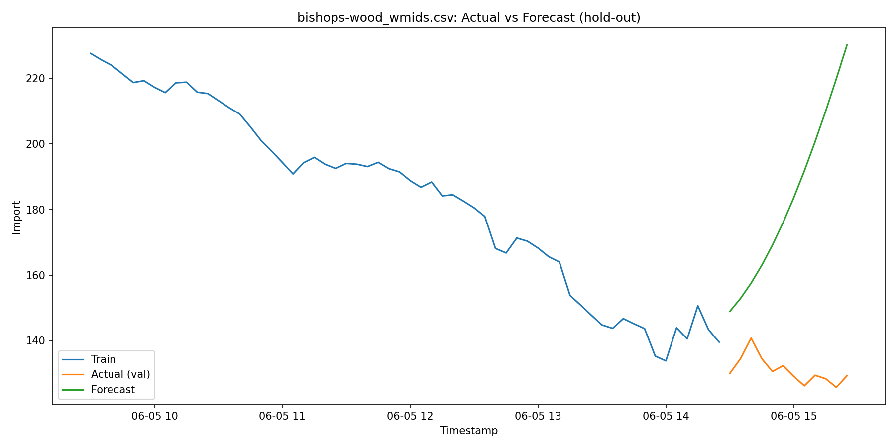

Grid-Supply Forecast Optimizer (Day 1: Setup & EDA)

Overview

This repository contains Day 1 of the Grid-Supply Forecast Optimizer project, focusing on:

Environment setup: Python virtual environments on Windows with PowerShell execution policies adjusted for venv activation.

Python version management: Installing and switching between Python 3.13 and Python 3.12 to ensure package compatibility (notably SHAP).

Dependency installation: PySpark, Prophet, SHAP, pandas, matplotlib.

Data ingestion: Downloading NGED Live GSP CSVs (multiple GSP zones) from the National Grid portal.

Exploratory Data Analysis (EDA):

Pandas scripts (eda_pandas.py, eda_multiple_gsps.py) to load, inspect, and plot the data.

PySpark script (eda_spark.py) to validate Spark ingestion and produce the same plots via Spark → pandas conversion.

## Project Structure
├GridSupplyForecast/
├── artifacts/                 
├── images/                   
│   ├── bishops-wood_eda_pandas.png
│   ├── bushbury_eda_pandas.png
│   ├── bustleholm_eda_pandas.png
│   ├── cellarhead_eda_pandas.png
│   ├── ...                    
│   └── day2_baseline_plot.png 
├── data/                      
├── eda_pandas.py              
├── eda_multiple_gsps.py       
├── eda_spark.py               
├── requirements.txt           
├── README.md                 
├── venv/                     
└── venv312/                   

Setup Instructions

1. Clone or download this repository.

2. Open in VS Code: File → Open Folder… → GridSupplyForecast.

3. Adjust PowerShell policy (once):
   Set-ExecutionPolicy -Scope CurrentUser RemoteSigned

4. Activate the Python 3.12 venv:
   .\venv312\Scripts\activate

5. Install dependencies:
   pip install -r requirements.txt

6. Verify VS Code’s interpreter points to \.venv312\Scripts\python.exe (bottom-right corner).

How to Run EDA

1. Pandas EDA (Single GSP)

python eda_pandas.py

Loads one CSV file from data/.

Prints DataFrame info, head, and missing-value counts.

Displays an hourly-averaged time-series plot.

2. Pandas EDA (Multiple GSPs)

python eda_multiple_gsps.py

Iterates over all *_wmids.csv in the root folder.

Prints info & head for each GSP.

Plots the first 7 days’ hourly average for each GSP.

3. Spark-based EDA

python eda_spark.py

Launches a local SparkSession.

Reads the same CSV via spark.read.csv(...).

Prints Spark schema & first 5 rows.

Converts a sample to pandas and displays the same hourly-average plot.

Spark warnings about winutils.exe and HADOOP_HOME are harmless for local batch reads.

(Replace with actual Spark EDA output if saved separately)

Day 1 Observations

Virtual environment setup: Adjusted PowerShell policy; activated Python 3.12 venv.

SHAP compatibility: Python 3.12 venv allowed pip to install prebuilt SHAP wheel on Windows.

Data ingestion: Successfully downloaded and loaded all GSP CSVs without missing timestamps.

EDA insights: Clear daily demand/import patterns visible in hourly-average plots across all GSPs.

   ### Day 2: Baseline Forecast with Prophet

...

